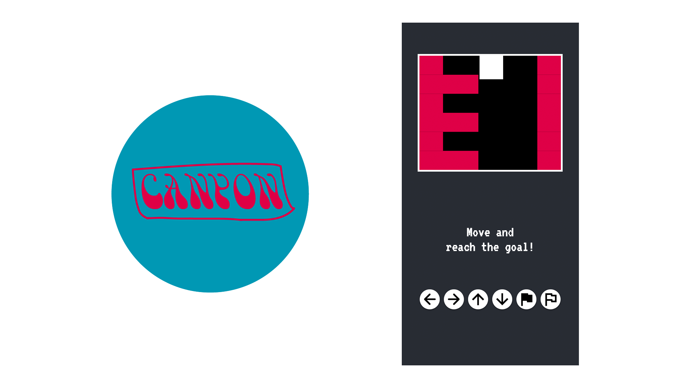

<p align="center">
 
</p>

# CANYON :moyai:

*Traverse canyons and find the goal!* :moyai:

## About :books:

Recently I have been studying how Flutter's `CustomPaint` widget works and wanted to see whether I could emulate
a Game Boy Pocket game as an Android app using Flutter. Short answer: Yes! Long answer: It's an experimental project, so
don't expect too much!

## Dedication :heart:

This project is dedicated to my Mom and my Dad.

## Downloads :inbox_tray:

- ***Moyai (Version 1.0.0): [Download for Android!]() (15.9 MB)***

## Building & Compilation :hammer:
If you want to make a build for Android, make sure you have the following tools installed:
- Flutter
- Android SDK
- Git
- Java JDK 8+
- Android SDK Platform tools (optional)
Once you have those tools on your system, follow these steps:
- 1.) Fetch the source code:
```bash
$ git clone https://github.com/iamtheblackunicorn/Canyon.git
```
- 2.) Change directory:
```bash
$ cd Canyon
```
- 3.) Fill in the Java Keystore password in the file `android/app/key.properties`. I am assuming you already have a Java Keystore in the form of a file called `key.jks` with the alias of `key`. If you don't, find out how to generate on by clicking [here]().
- 4.) Move the Java Keystore to `android/app`.
- 5.) Compile a binary distribution to install on your device(s):
```bash
$ clear && flutter build apk
```
- 6.) Transfer the generated `APK` to your Android device and install it.
- 7.) Turn up the volume and enjoy!

## Changelog :black_nib:

### ***Version 1.0.0 "Moyai"***
- initial release
- performance optimizations


## Note :scroll:

- *Acid Time :rainbow: :pill:* by Alexander Abraham :black_heart: a.k.a. *"The Black Unicorn" :unicorn:*
- Licensed under the MIT license.
